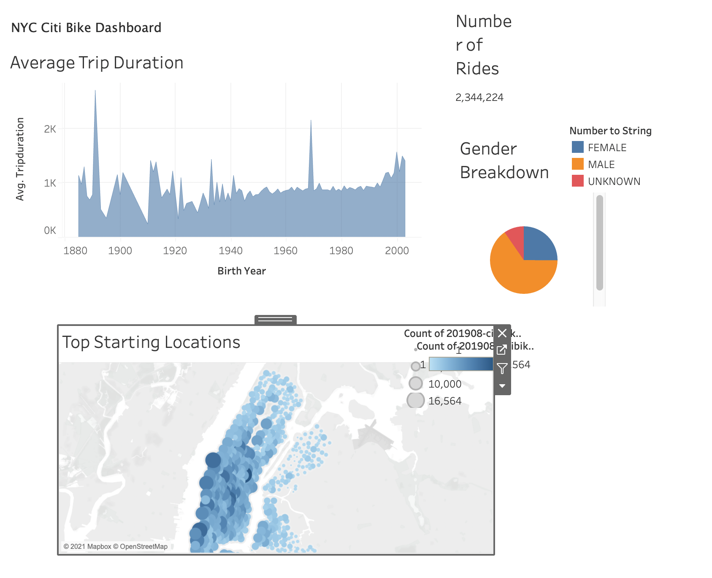

# Module 14: Bikesharing Project

### Purpose
The purpose of this project is to analyze New York City's bikesharing data using Tableau, a ubiquitous data analysis and visulatization tool.

### Results

- 81.1 percent of the users are subscribers.

- 65.3 percent of the users are male.

- Bike usage is highest in lower manhattan area near commercial and office buildings

-  Most trip durations are under 30 minutes. Users being predominantly male.

 
* Bike usage during weekdays are highest during commute hours.

* Bike usage during weekends are uniform throughout the day. 

### Summary
Citibike in New York city is most popular amongst Male Subscriber users. It is highly used for weekday commutes and they are used evenly throughout the day during weekends. Ideal bike repair hourse would be between 2AM and 5AM when usage is lowest. Marketing should be targeted towards female/unknown customers. Gathering data on Desmoines Iowa's number on commercial buildings/offices also more information on the residents commuting situation would be helpful. 
